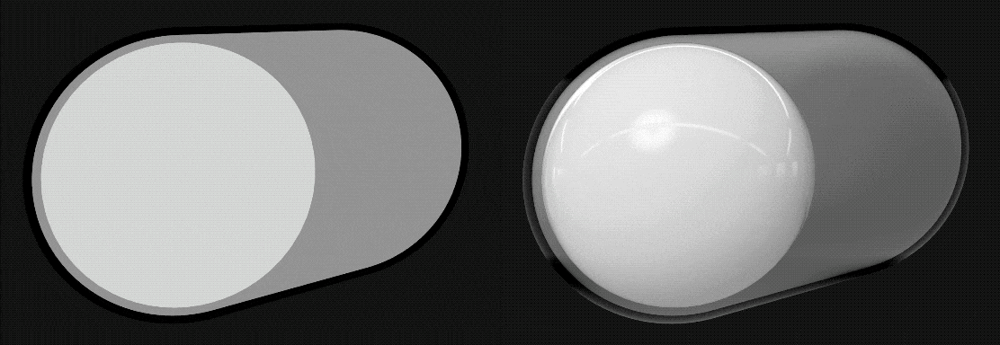
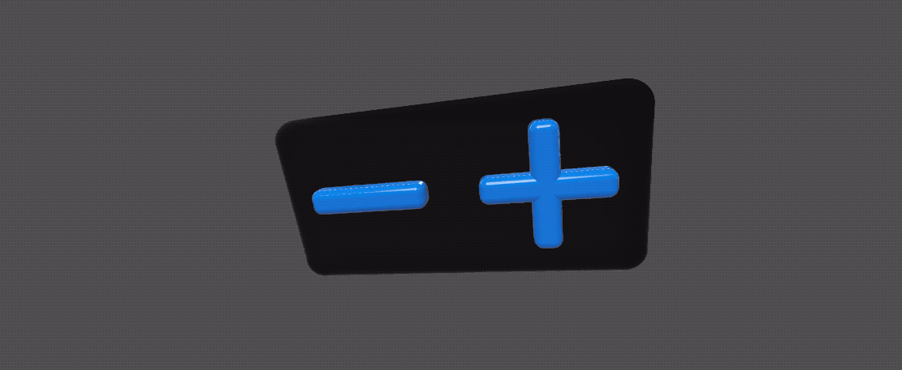
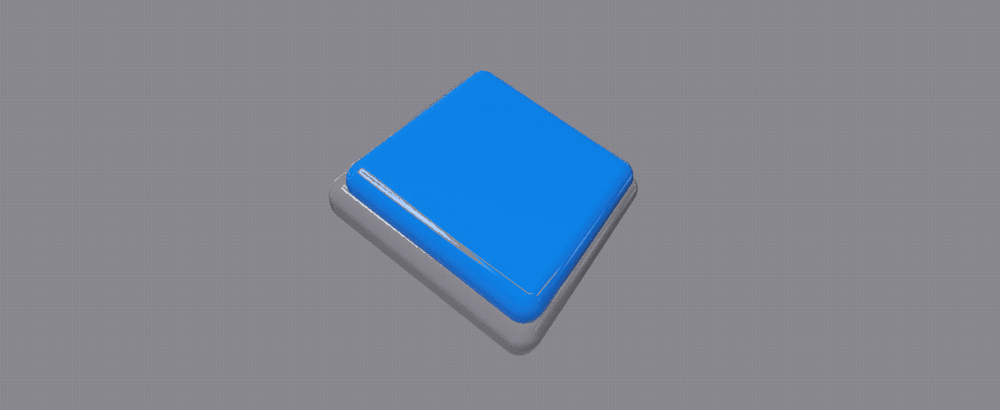

# RealityUI

RealityUI is a collection of User Interface classes for RealityKit.
The classes included in RealityUI aim to offer familiar User Interface guidelines, but in a 3D setting for Augmented and Virtual Reality through RealityKit.

The User Interface controls in this repository so far are made to be familiar to what people are used to with 2D interfaces, however the plan is to expand the tools on offer to new and unique controls, which are more appropriate for an Augmented Reality and Virtual Reality context. 

<p align="center">
  
  
  
  
</p>


## Requirements

- iOS 13 or macOS 10.15
- Swift 5.2
- Xcode 11

RUISlider gestures are not working with macOS currently.

## Content

- [Installation](#installation)
- [Usage](#usage)
- [RealityUI Entities](#creating-realityui-entities)
  - [RUISwitch](#ruiswitch-creation)
  - [RUIStepper](#ruistepper-creation)
  - [RUISlider](#ruislider-creation)
  - [RUIButton](#ruibutton-creation)
- [RealityUI Components](#realityui-components)
  - [RUIComponent](#ruicomponent)
  - [SwitchComponent](#switchcomponent)
  - [StepperComponent](#steppercomponent)
  - [SliderComponent](#slidercomponent)
  - [ButtonComponent](#buttoncomponent)

## Installation

### Swift Package Manager

Add the URL of this repository to your Xcode 11+ Project under `Project > Swift Packages`.

`https://github.com/maxxfrazer/RealityUI.git`

## Usage

Add `import RealityUI` to the top of your swift file to start.

#### Registering RealityUI Components

All components used in RealityUI must be registered before they are used, simply call `RealityUI.registerComponents()` anywhere in your app before any classes starting with `RUI` are initialised to avoid issues with that. For more information on what is meant by registering components [see Apple's documentation here](https://developer.apple.com/documentation/realitykit/component/3243766-registercomponent).

#### Activating Gestures

If you plan on using RUISwitch or RUIStepper, then you should at least enable `.tap`
RUISlider uses `.pan`, but I would just recommend using `.all` to avoid issues, as these will inevitably move around ad RealityUI develops, and will not interfere with the rest of your RealityKit scene.

`arView.enableRealityUIGestures(.all)`

---
## Creating RealityUI Entities

For the sake of all these examples, the _Simple_ heading will create an Entity with no custom properties or callbacks, and for _Functional_, imagine there is a `ModelEntity` in the scene which we can reference from the variable `adjustmentCuboid`.

By default all RealityUI Entities are quite large. This is used to standardize the sizes so that you always know what to expect. For example, all UI thumbs are spheres with a diameter of 1 meter, which is 1 unit in RealityKit, ± any padding adjustments. All RealityUI Entities face `[0, 0, 1]` by default, in the same way as a ModelEntity with a [plane mesh](https://developer.apple.com/documentation/realitykit/meshresource/3244419-generateplane).

## RUISwitch Creation

RUISwitch is a 3D toggle switch with an on and off state.


Default bounding box is 2x1x1m

##### Simple

```swift
let newSwitch = RUISwitch()
```

##### Functional

This RUISwitch will respond to lighting, and will change a ModelEntity's material between a red and a green color.

```swift
let newSwitch = RUISwitch(
  RUI: [RUIComponent](#ruicomponent)(respondsToLighting: true),
  changedCallback: { mySwitch in
    adjustmentCuboid.model?.materials = [
      SimpleMaterial(
        color: mySwitch.isOn ? .green : .red,
        isMetallic: false
      )
    ]
  }
)
```

To customise switches further, see [SwitchComponent](#switchcomponent).

## RUIStepper Creation

RUIStepper is used to increment or decrement a value.


Default bounding box is 2x1x0.25m

##### Simple

```swift
let newStepper = RUIStepper()
```

##### Functional

This RUIStepper will move a ModelEntity's y position up and down by 0.1m on each tap.

```swift
let stepper = RUIStepper(upTrigger: { _ in
  adjustmentCuboid.position.y += 0.1
}, downTrigger: { _ in
  adjustmentCuboid.position.y -= 0.1
})
```
To customise steppers further, see [StepperComponent](#steppercomponent).


## RUISlider Creation

An interactive track to represent an interpolated value.


Default bounding box is 10x1x1m (Including thumb)

##### Simple

```swift
let newSlider = RUISlider()
```

##### Functional

This RUISlider has a starting value of 0.9, meaning that the thumb will be positioned 90% of the way along. The callback function will happen every time the slider value changes (set with `isContinuous`). The callback function will adjust the x scale of an Entity to the slider's value (0-1), plus an arbitrary value of 0.1.

```swift
let newSlider = RUISlider(
  slider: SliderComponent(startingValue: 0.9, isContinuous: true)
) { (slider, _) in
  adjustmentCuboid.scale.x = slider.value + 0.1
}
```
To customise sliders further, see [SliderComponent](#slidercomponent).

## RUIButton Creation

RUIButton is used to initiate a specified action. The action here will only trigger if the gesture begins on a button, and also ends on the same button. This is similar to the [touchUpInside UIControl Event](https://developer.apple.com/documentation/uikit/uicontrol/event/1618236-touchupinside).


Default button bounding box before depressing the button into the base is `[1, 1, 0.3]`

##### Simple

```swift
let newButton = RUIButton()
```

##### Functional

This RUIButton will animate an Entity to a new transform, and change its own button color to `.systemGreen`.

```swift
let button = RUIButton(updateCallback: { myButton in
  adjustmentCuboid.move(
    to: Transform(
      scale: .one,
      rotation: .init(),
      translation: [0, 1, 0]),
    relativeTo: adjustmentCuboid.parent,
    duration: 0.3
  )
  myButton.buttonColor = .systemGreen
})
```
To customise buttons further, see [ButtonComponent](#buttoncomponent).

---

## RealityUI Components

These components are largely for customising RealityUI entities in terms of colour and sizing. The components default values are great for most use-cases, but there may be times when more customisation is necessary.

### RUIComponent

| Property           | Type | Default | Description|
|--------------------|------|---------|------------|
| ruiEnabled         | Bool | `true`    | A Boolean value showing if the entity can be clicked or otherwise affected by gestures.<br><br>When set to `false` all the materials become translucent.|
| respondsToLighting | Bool | `false`   | A Boolean value which affects the materials used on this Entity to be affected by light.|


### SwitchComponent

SwitchComponent is used for the RUISwitch class, it has properties which affect colour for each model, as well as sizing between components such as the border.

| Property    | Type           | Default      | Description |
|-------------|----------------|--------------|----------------------------------------------------------------------------|
| isOn        | Bool           | false        | A Boolean value that determines the off/on state of the switch. |
| padding     | Float          | 0.05         | Padding (in meters) between the thumb and the inner capsule of the switch. |
| border      | Float          | 0.05         | Border (in meters) between the two outer capsules of the switch. |
| onColor     | [Material.Color](https://developer.apple.com/documentation/realitykit/material/color) | .systemGreen | Color of the inner capsule when the switch is set to `on`. |
| offColor    | [Material.Color](https://developer.apple.com/documentation/realitykit/material/color) | .lightGray   | Color of the inner capsule when the switch is set to `off`. |
| borderColor | [Material.Color](https://developer.apple.com/documentation/realitykit/material/color) | .black       | Color of the outer border. |
| thumbColor  | [Material.Color](https://developer.apple.com/documentation/realitykit/material/color) | .white       | Color of the thumb. Default white. |

### StepperComponent

| property | type | Default | Description |
|------------------|-----------------|---------------------------|------------------------------------------------------------------------------------|
| backgroundTint | [Material.Color](https://developer.apple.com/documentation/realitykit/material/color) | .tertiarySystemBackground | Background color of the stepper. |
| buttonTint | [Material.Color](https://developer.apple.com/documentation/realitykit/material/color) | .systemBlue | Color of the buttons inside a stepper, default `.systemBlue`. |
| secondButtonTint | [Material.Color](https://developer.apple.com/documentation/realitykit/material/color)? | nil | Color of the second button inside a stepper.<br>If nil, then buttonTint will be used. |

### SliderComponent

| Property | Type | Default | Description |
|---------------|----------------|-------------|--------------------------------------------------------------------------------------------------------------------------|
| length | Float | 10 | Length of the slider in meters. |
| value | Float | 0 | The slider's current value (0-1). |
| minTrackColor | [Material.Color](https://developer.apple.com/documentation/realitykit/material/color) | .systemBlue | The color set to the material on the left side of the slider. |
| maxTrackColor | [Material.Color](https://developer.apple.com/documentation/realitykit/material/color) | .systemGray | The color set to the material on the right side of the slider. |
| thumbColor | [Material.Color](https://developer.apple.com/documentation/realitykit/material/color) | .white | The color set to the material of the thumb. |
| isContinuous | Bool | true | If set to true, you can receive all changes to the value, otherwise only at the start and end of changes made via touch. |
| thickness | Float | 0.2 | The thickness of the track in meters. |

### ButtonComponent

| Property | Type | Default | Description |
|--------------|-----------------------|--------------|--------------------------------------------------------------------------------------------------------------------------------------------------------------|
| size | [SIMD3\<Float\>](https://developer.apple.com/documentation/swift/simd3) | [1, 1, 0.2] | Size of the button base (in m). |
| buttonColor | [Material.Color](https://developer.apple.com/documentation/realitykit/material/color) | .systemBlue | Color of the button. |
| baseColor | [Material.Color](https://developer.apple.com/documentation/realitykit/material/color) | .systemGray | Color of the button base. |
| padding | Float | 0.1 | Padding (in meters) between the base and the button. |
| extrude | Float | 0.5 | Multiplyer amount that the button sticks out from the base when unpressed.<br>The extrude amount will be a multiplier of the button z size. |
| compress | Float | 0.2 | Multiplyer amount that the button sticks out from the base when pressed.<br>The compress amount will be a multiplier of the button z size. |
| cornerRadius | Float? | nil | A corner radius applied to both the button and the button base.<br>If left as nil, a corner radius will be calculated based on 0.4 * the smallest dimension. |
| style | ButtonComponent.Style | .rectangular | Style of RUIButton, currently only `.rectangular` is available. |

---
#### More

To see more, check out [RealityUI+Examples](./RealityUI+Examples) in this repository.
